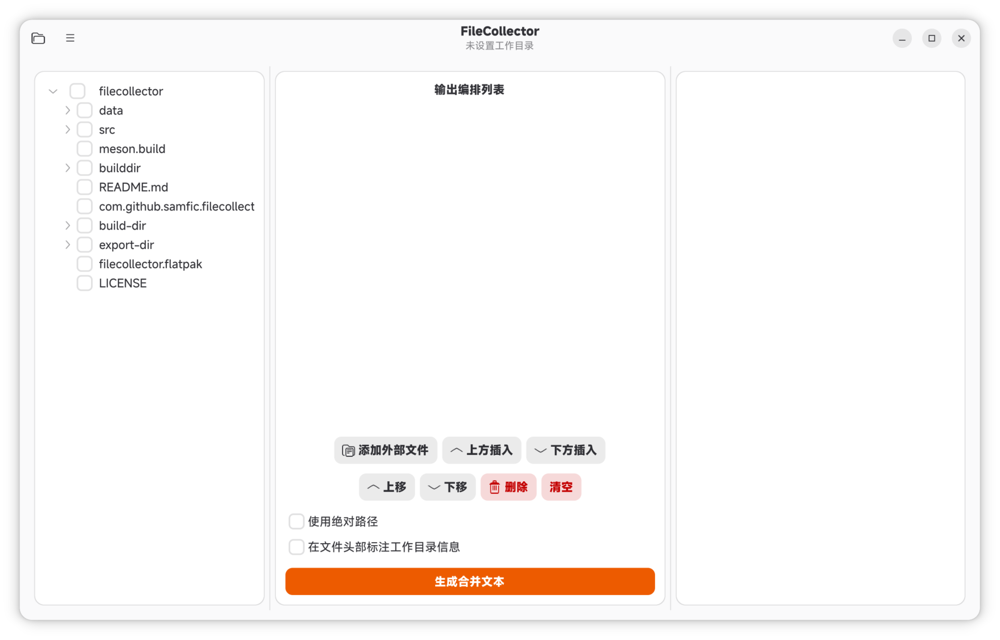

# FileCollector

<div align="center">
  
</div>

[中文版](README.md) · [English Version](README_EN.md)

---

FileCollector 是一款跨平台的桌面小工具，用于高效收集、编排工作目录中的文件并生成合并文本。  
它提供了可勾选的目录树、灵活的编排列表、文字插入、拖放排序和编码自动检测，非常适合将项目中的关键代码或文档快速整合成一个 TXT 文件，供后续分析或提交给大语言模型使用。

## 界面预览



## 功能特性

- 项目管理：打开和保存项目
- 短语管理：管理和组织常用短语
- 现代化界面：采用 GNOME Human Interface Guidelines 设计

> **提示**：如果您使用的是非 GNOME 平台（如 Windows 或 macOS），请移步 [PySide6 版本仓库](https://github.com/Sam-Fic/filecollector)。该版本跨平台支持 Windows、macOS 和 Linux，基于 PySide6 构建。

## 预编译 Flatpak 包（推荐）

预编译好的 Flatpak 包发布在 [Releases](https://github.com/Sam-Fic/filecollector-gnome/releases) 页面。如果您不想自行编译，可直接下载 `.flatpak` 文件安装使用。

```bash
flatpak install --user <下载的.flatpak文件>
```

运行：

```bash
flatpak run com.github.samfic.filecollector
```

## 自行构建

### 安装依赖

#### Debian/Ubuntu

```bash
sudo apt install meson valac libgtk-4-dev libadwaita-1-dev libjson-glib-dev blueprint-compiler
```

#### Fedora

```bash
sudo dnf install meson vala gtk4-devel libadwaita-devel json-glib-devel blueprint-compiler
```

### 构建与安装

```bash
mkdir -p build && cd build
meson setup ..
meson compile
sudo meson install
```

> **提示**：如果之前已经构建过，修改源码后只需在 `build/` 目录下重新运行 `meson compile` 即可增量编译。

### 运行

```bash
filecollector
```

### Flatpak 构建

```bash
flatpak-builder build-dir com.github.samfic.filecollector.json --user --install --force-clean
flatpak run com.github.samfic.filecollector
```

## 项目结构

```
.
├── data/           # 应用程序数据文件
│   ├── com.github.samfic.filecollector.desktop
│   ├── com.github.samfic.filecollector.metainfo.xml
│   ├── com.github.samfic.filecollector.svg
│   ├── filecollector.gresource.xml
│   └── style.css
├── screenshots/    # 截图文件
├── src/            # 源代码
│   ├── main.vala   # 应用程序入口
│   ├── window.vala # 主窗口逻辑
│   └── window.blp  # Blueprint UI 描述
├── BUILD_FLATPAK.md                      # Flatpak 构建指南（供 AI 助手参考）
├── meson.build                           # Meson 构建配置
└── com.github.samfic.filecollector.json  # Flatpak 构建清单
```

## 为什么使用此工具？

1. **解决编程工具的上下文困境**：在编程工具中，模型为了探索工作区需要进行大量工具调用，很容易被无关文件干扰而偏离主题。超大项目还容易触发上下文压缩。此外，编程工具中大量的系统提示词会消耗大量 Token。使用此工具人工挑选重要文件，将整理好的上下文交给网页端模型（系统提示词相对较少）进行 bug 分析等深度推理，以最大化模型推理性能。

2. **成本控制**：网页端模型大多是免费（或有额度）的，不是吗？

## 未来规划

目前 FileCollector 是一个独立运行的桌面工具。下一步计划是将其封装为 **MCP (Model Context Protocol) 服务** 或 **技能 (Skills)**，让编程工具（如 Cursor、VS Code + Copilot）中的大语言模型能够直接调用它完成以下工作流：

1. 用户对编程工具中的模型下达问题指令（例如“此项目有xx问题，请帮我寻找与此相关的文件并导出单个 TXT 文件”）。
2. 模型执行文件探索，利用该工具勾选出与问题相关的关键文件。
3. 模型在合适的位置插入指令（要解决的问题）。
4. 调用工具生成一份结构化的 TXT 文件。
5. 用户将此 TXT 文件上传到网页端大语言模型（如 Claude、ChatGPT 等）进行深度推理和问题解决规划。
6. 根据模型返回的规划，用户可以在编程工具使用低成本模型执行实际的问题解决操作。

这种设计将 **文件探索与代码挑选**（由编程工具内的模型完成）与 **复杂推理**（由网页端模型完成）分离，充分利用不同模型的优势，同时保持成本可控。

> 欢迎贡献想法或参与开发！

## 许可证

本项目采用 MIT 许可证。

> 本项目完全通过 **vibe coding** 方式开发完成。
