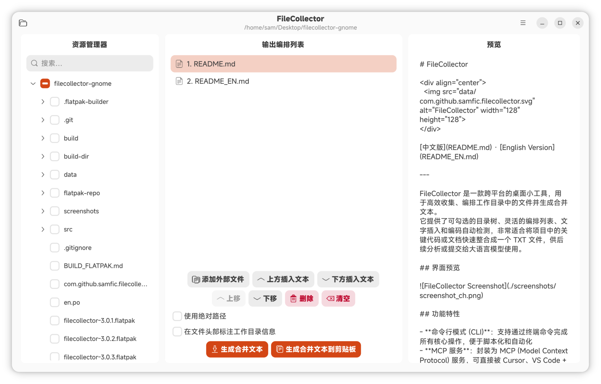

# FileCollector

<div align="center">
  
</div>

[中文版](README.md) · [English Version](README_EN.md)

---

FileCollector 是一款跨平台的桌面小工具，用于高效收集、编排工作目录中的文件并生成合并文本。  
它提供了可勾选的目录树、灵活的编排列表、文字插入和编码自动检测，非常适合将项目中的关键代码或文档快速整合成一个 TXT 文件，供后续分析或提交给大语言模型使用。内置的 AI 助手侧边栏支持自然语言驱动文件探索、勾选与编排。

## 界面预览



## 使用说明

图形界面使用流程与 Tips，请参阅 [使用说明文档](docs/USAGE.md)。

## 功能特性

- **命令行模式 (CLI)**：支持通过终端命令完成所有核心操作，便于脚本化和自动化
- **MCP 服务**：封装为 MCP (Model Context Protocol) 服务，可直接被 Cursor、VS Code + Copilot 等编程工具调用
- **二进制文件预转换**：自动将图片、PDF、Office 文档等二进制文件转换为 Markdown 格式，支持缓存和可配置扩展名
- **AI 助手面板**：内置侧边栏聊天界面，AI 可直接驱动文件树探索、勾选、编排、生成合并文本等操作
- **渐进式体验**：CLI 处理与 GUI 微调无缝衔接，AI 后台自动探索编排后，可随时用图形界面人工接管调整
- **项目管理**：打开和保存项目
- **短语管理**：管理和组织常用短语
- **国际化**：支持中文和英文界面，跟随系统语言自动切换
- **现代化界面**：采用 GNOME Human Interface Guidelines 设计
- **Git 提交历史集成**：一键收集工作区改动文件、导出 Diff 代码块，快速为 AI 构建 Git 上下文
- **全局内容搜索**：`Ctrl+Shift+F` 弹出搜索对话框，支持后台异步扫描、编码自动识别、结果高亮，一键将命中文件添加到编排列表
- **场景化编排模板**：内置 Bug 分析、API 文档生成、代码重构等模板，通过 `/t <id>` 斜杠指令一键插入结构化占位符并驱动 AI 执行
- **AI 生成阅读指南**：一键让 AI 分析编排列表中的文件，生成结构化的目录与阅读指南

> **提示**：如果您使用的是非 GNOME 平台（如 Windows 或 macOS），请移步 [Flet 版本仓库](https://github.com/Sam-Fic/filecollector)。该版本跨平台支持 Windows、macOS 和 Linux，基于 Flet 构建。

## 为什么使用此工具？

1. **解决编程工具的上下文困境**：在编程工具中，模型为了探索工作区需要进行大量工具调用，很容易被无关文件干扰而偏离主题。超大项目还容易触发上下文压缩。此外，编程工具中大量的系统提示词会消耗大量 Token。使用此工具人工或使用 MCP 服务挑选重要文件，将整理好的上下文交给网页端模型（系统提示词相对较少）进行 bug 分析等深度推理，以最大化模型推理性能。

2. **成本控制**：网页端模型大多是免费（或有额度）的，不是吗？

## 预编译 Flatpak 包（推荐）

预编译好的 Flatpak 包发布在 [Releases](https://github.com/Sam-Fic/filecollector-gnome/releases) 页面。如果您不想自行编译，可直接下载 `.flatpak` 文件安装使用。

```bash
flatpak install --user <下载的.flatpak文件>
```

运行：

```bash
flatpak run com.github.samfic.filecollector
```

## 自行构建

### 安装依赖

#### Debian/Ubuntu

```bash
sudo apt install meson valac libgtk-4-dev libadwaita-1-dev libjson-glib-dev libsoup-3.0-dev libgee-0.8-dev libsecret-1-dev libcmark-gfm-dev libgtksourceview-5-dev blueprint-compiler gettext
```

#### Fedora

```bash
sudo dnf install meson vala gtk4-devel libadwaita-devel json-glib-devel libsoup3-devel libgee-devel libsecret-devel cmark-gfm-devel gtksourceview5-devel blueprint-compiler gettext
```

> **可选运行时依赖**（仅二进制文件预转换功能需要）：LibreOffice（`libreoffice`）用于将文档转为 PDF；`poppler-utils` 提供 `pdftoppm` 用于 PDF 渲染为图片。如不使用 VLM 预转换功能可不安装。

### 构建与安装

```bash
mkdir -p build && cd build
meson setup ..
meson compile
sudo meson install
```

> **提示**：如果之前已经构建过，修改源码后只需在 `build/` 目录下重新运行 `meson compile` 即可增量编译二进制。若修改了翻译文件（`en.po` 或 UI 中的 `_()` 字符串），则需要重新运行 `sudo meson install` 以更新翻译文件到系统路径。

### 运行

```bash
filecollector          # 启动图形界面
filecollector --help   # 查看 CLI 命令行帮助
filecollector --gui    # 强制启动图形界面（无其他 CLI 参数时第一行等价）
```

> **提示**：
>
> - 程序默认跟随系统语言显示中文或英文界面。如需临时切换语言，可使用环境变量，例如 `LANGUAGE=en filecollector` 强制显示英文。该环境变量同时对图形界面和 CLI 命令行模式生效。
> - 如需使用 CLI 命令行模式，请参见下方的 [CLI 命令行模式](#cli-命令行模式) 章节。
> - **GUI 与 CLI 的行为规则**：当检测到任何 CLI 参数（`--work-dir`、`--select-file`、`--load` 等）时，程序默认进入命令行模式，不会弹出图形界面。**例外**：添加 `--gui` 参数可强制打开图形界面，CLI 参数仅用于初始化界面状态（工作目录、勾选文件等），初始化完成后可接续使用 GUI 供人工微调，GUI 若在运行中，CLI 的操作会反映在 GUI 上。这在 MCP 自动化流程与人工审查切换时非常有用。

### Flatpak 构建

```bash
flatpak-builder build-dir com.github.samfic.filecollector.json --user --install --force-clean
flatpak run com.github.samfic.filecollector
```

也可以将 [BUILD_FLATPAK.md](BUILD_FLATPAK.md) 直接交给编程工具或 AI Agent，利用现有成熟流程完成规范化打包。

## 项目结构

```
.
├── data/                                  # 应用程序数据文件
│   ├── com.github.samfic.filecollector.desktop
│   ├── com.github.samfic.filecollector.metainfo.xml
│   ├── com.github.samfic.filecollector.svg
│   ├── filecollector.gresource.xml
│   └── style.css
├── screenshots/                           # 截图文件
├── src/                                   # 源代码
│   ├── main.vala                          # 应用程序入口（自动检测 CLI 或 GUI 模式）
│   ├── cli.vala                           # CLI 命令行控制器
│   ├── window.vala                        # 主窗口逻辑
│   ├── window.blp                         # Blueprint UI 描述
│   ├── config.vala.in                     # 版本号等配置模板
│   ├── controllers/
│   │   ├── ai_controller.vala             # AI 助手控制器
│   │   └── project_controller.vala        # 项目控制器
│   ├── models/
│   │   ├── app_state.vala                 # 应用状态模型
│   │   ├── item_data.vala                 # 队列项数据模型
│   │   ├── git_commit.vala                # Git 提交数据模型
│   │   ├── prompt_template.vala           # 场景化编排模板模型
│   │   └── search_result.vala             # 全局搜索结果模型
│   ├── services/
│   │   ├── ai_client.vala                 # AI 助手后端（OpenAI 兼容接口 + Function Calling）
│   │   ├── ai_types.vala                  # AI 共享类型定义
│   │   ├── binary_converter.vala          # 二进制文件转 Base64（图片缩放 + 文档转 PDF 渲染）
│   │   ├── binary_preprocessor.vala       # 二进制文件预处理调度（VLM 调用与缓存管理）
│   │   ├── config_manager.vala            # 配置/设置/常用语/模板持久化
│   │   ├── file_generator.vala            # 文件合并生成与剪贴板复制
│   │   ├── git_service.vala               # Git 只读操作服务（status/diff/log/show）
│   │   ├── multimodal_ai_client.vala      # VLM 客户端（发送 Base64 图片给视觉模型）
│   │   ├── preprocess_cache.vala          # 预转换缓存（SHA256 哈希 + manifest 管理）
│   │   ├── project_manager.vala           # 项目保存与加载
│   │   ├── search_service.vala            # 全局内容搜索引擎（异步、二进制跳过、编码识别）
│   │   ├── undo_manager.vala              # 撤销/重做管理
│   │   └── vlm_queue.vala                 # VLM 预处理队列管理器（并发控制、暂停/取消）
│   ├── utils/
│   │   ├── encoding_helper.vala           # 编码自动检测与转换
│   │   └── glob_helper.vala               # 全局路径匹配工具
│   ├── vapi/
│   │   └── cmark.vapi                     # cmark (Markdown) Vala 绑定
│   └── widgets/
│       ├── ai_panel.vala                  # AI 助手聊天面板（气泡 + 工具调用卡片 + 斜杠指令补全）
│       ├── ai_settings_dialog.vala        # AI 助手配置对话框
│       ├── global_search_dialog.vala      # 全局内容搜索对话框
│       ├── markdown_view.vala             # Markdown 渲染视图
│       ├── phrases_picker.vala            # 常用语选择器与管理
│       ├── settings_dialog.vala           # 设置对话框
│       └── templates_manager.vala         # 场景化编排模板管理对话框
├── docs/                                  # 使用说明文档
│   ├── images/                            # 文档图片
│   ├── USAGE.md                           # 中文使用说明
│   └── USAGE_EN.md                        # 英文使用说明
├── en.po                                  # 英文界面翻译文件
├── POTFILES                               # 可翻译源文件列表（供 gettext 使用）
├── LINGUAS                                # 支持的语言列表
├── BUILD_FLATPAK.md                       # Flatpak 构建指南（供 AI 助手参考）
├── meson.build                            # Meson 构建配置
└── com.github.samfic.filecollector.json   # Flatpak 构建清单
```

## 键盘快捷键

| 快捷键         | 操作           |
| -------------- | -------------- |
| `Ctrl+O`       | 打开项目       |
| `Ctrl+S`       | 保存项目       |
| `Ctrl+N`       | 清空列表       |
| `Ctrl+E`       | 添加外部文件   |
| `Ctrl+I`       | 上方插入文本   |
| `Ctrl+Shift+I` | 下方插入文本   |
| `Ctrl+↑`       | 上移选中项     |
| `Ctrl+↓`       | 下移选中项     |
| `Delete`       | 删除选中项     |
| `Ctrl+G`       | 生成合并文本   |
| `Ctrl+Shift+C` | 生成到剪贴板   |
| `Ctrl+J`       | 显示/隐藏 AI 助手 |
| `Ctrl+Shift+F` | 全局内容搜索   |
| `Ctrl+,`       | 语言设置       |
| `Ctrl+/`       | 显示键盘快捷键 |
| `F1`           | 关于           |
| `Ctrl+Q`       | 退出           |

可在菜单栏 **键盘快捷键** 中查看所有快捷键。

## CLI 命令行模式

FileCollector 内置命令行模式，无需启动图形界面即可通过终端完成所有核心操作，适合脚本化和自动化集成。同时，如果 GUI 正在使用，CLI 模式也可以无缝对接 GUI 的进度和状态。

### 使用方式

在终端中运行 `filecollector` 并附加 CLI 参数即可进入命令行模式。若未检测到 CLI 参数，则正常启动图形界面。

```bash
filecollector [选项...]
```

### 命令列表

| 选项                 | 说明                              |
| -------------------- | --------------------------------- |
| `--work-dir DIR`     | 设置工作目录                      |
| `--select-file PATH` | 添加文件到编排列表（可多次使用）  |
| `--add-text "TEXT"`  | 添加自定义文字（可多次使用）      |
| `--move FROM TO`     | 将索引 FROM 处的项目移动到索引 TO |
| `--remove INDEX`     | 删除索引 INDEX 处的项目           |
| `--clear`            | 清空编排列表                      |
| `--list-items`       | 列出当前编排列表                  |
| `--export PATH`      | 导出合并文本到文件                |
| `--absolute`         | 使用绝对路径                      |
| `--header`           | 添加头部信息（工作目录路径）      |
| `--load FILE`        | 从项目文件加载状态                |
| `--save FILE`        | 将当前状态保存到项目文件          |
| `--gui`              | 使用 CLI 参数初始化后打开图形界面 |
| `--help`, `-h`       | 显示帮助信息                      |

### 完整工作流示例

**构建并导出：**

```bash
filecollector --work-dir ./project \
    --select-file src/main.vala \
    --select-file src/utils/helper.vala \
    --add-text "=== 以下为配置文件 ===" \
    --select-file config.ini \
    --move 3 2 \
    --header \
    --export output.txt
```

**从项目文件导出：**

```bash
filecollector --load my.project.fcol --export output.txt
```

**构建并保存项目（供 GUI 使用）：**

```bash
filecollector --work-dir ./project \
    --select-file file1.txt --select-file file2.txt \
    --save my.project.fcol
```

**查看编排列表：**

```bash
filecollector --load my.project.fcol --list-items
```

**加载项目后用 GUI 手动调整：**

```bash
filecollector --load my.project.fcol --gui
```

### 设计说明

CLI 模式与 GUI 模式共享同一套数据模型和业务服务（`ItemData`、`FileGenerator`、`ProjectManager`），但 CLI 模式不依赖 GTK/Adw 图形库，启动更快。核心代码集中在独立的 [cli.vala](src/cli.vala) 文件中。

## MCP (Model Context Protocol) 服务

FileCollector 已经封装为 MCP 服务，现在编程工具（如 Cursor、VS Code + Copilot）中的大语言模型可以直接调用它完成以下工作流：

1. 用户对编程工具中的模型下达问题指令（例如"此项目有 xx 问题，请帮我寻找与此相关的文件并导出单个 TXT 文件"）。
2. 模型执行文件探索，利用该工具勾选出与问题相关的关键文件。
3. 模型在合适的位置插入指令（要解决的问题）。
4. 调用工具生成一份结构化的 TXT 文件。
5. 用户将此 TXT 文件上传到网页端大语言模型（如 Claude、ChatGPT 等）进行深度推理和问题解决规划。
6. 根据模型返回的规划，用户可以在编程工具使用低成本模型执行实际的问题解决操作。

这种设计将 **文件探索与代码挑选**（由编程工具内的模型完成）与 **复杂推理**（由网页端模型完成）分离，充分利用不同模型的优势，同时保持成本可控。

**查看 [filecollector-mcp-server](https://github.com/Sam-Fic/filecollector-mcp-server) 了解更多详情和安装使用方法**

## AI 助手面板

FileCollector 内置 **侧边栏 AI 助手**，无需编程工具或 MCP 服务，直接在 GUI 中就能用自然语言驱动整个工作流。点击工具栏左上角的 **AI** 按钮即可展开/收起。

### 主要能力

- **自然语言编排**：告诉 AI "把 `src` 目录下所有 Python 文件加进去，然后在开头插入一段任务说明"，AI 会自动调用工具完成勾选、插入文字、调整顺序等所有步骤。
- **文件探索与读取**：AI 可以浏览工作目录的文件树，并按需读取文件内容辅助决策。
- **即时反馈**：每一步工具调用（设置工作目录、添加文件、读取文件、调整顺序等）都以可展开的工具卡片实时展示，结果一目了然。
- **与 GUI 实时同步**：AI 改动编排列表后，中间面板立刻更新预览，用户可随时接管微调。
- **斜杠指令自动补全**：在 AI 输入框中输入 `/t` 或 `/template`，自动弹出模板列表，支持键盘 ↑↓ 导航、Enter 确认、Esc 取消，鼠标点击直接应用。
- **AI 本地旁路注入**：`add_git_diff` 和 `add_git_commit_diff` 工具在本地执行 Git 命令并直接注入队列，Diff 内容完全不经过 LLM 上下文，节省大量 Token 并突破 API 限制。

### 支持的工具（Function Calling）

AI 通过以下工具与 GUI 引擎交互（与 CLI / MCP 共享同一套语义）：

| 工具               | 作用                                   |
| ------------------ | -------------------------------------- |
| `set_work_dir`     | 切换工作目录                           |
| `add_files`        | 批量添加文件到编排列表                 |
| `add_text`         | 在列表中插入自定义文字                 |
| `remove_item`      | 按 id 删除列表条目                     |
| `move_item`        | 调整条目顺序                           |
| `clear_items`      | 清空编排列表                           |
| `set_use_absolute` | 切换绝对路径 / 相对路径模式            |
| `set_show_header`  | 切换是否在文件头标注工作目录           |
| `list_files`       | 浏览工作目录（递归列出符合条件的文件） |
| `read_file`        | 读取文件内容（带行号）                 |
| `get_git_status`   | 获取 Git 工作区状态（已修改/新增的文件）|
| `get_git_diff`     | 获取 Git Diff（工作区或暂存区）        |
| `get_git_log`      | 列出最近的 Git 提交记录               |
| `get_git_commit_diff` | 获取指定 Commit 的代码差异          |
| `add_git_diff`     | 将当前工作区/暂存区 Diff 直接注入编排列表（绕过 LLM，节省 Token）|
| `add_git_commit_diff` | 将指定 Commit 的 Diff 直接注入编排列表（绕过 LLM）          |

### 二进制文件预转换（VLM）

FileCollector 支持自动将二进制文件转换为 Markdown 格式，无需用户手动处理。

- **图片文件**（PNG、JPEG、WebP、BMP、TIFF 等）：自动缩放至最大 2048px 并编码为 Base64，直接发送给 VLM 进行文字提取或内容理解。
- **文档文件**（PDF、DOCX、PPTX、XLSX、ODT、ODP、ODS、RTF 等）：先通过 LibreOffice 转换为 PDF，再通过 `pdftoppm` 渲染为图片序列，逐页发送给 VLM。
- **转换缓存**：转换结果缓存在工作目录下的 `.filecollector_cache/` 目录中，基于文件 SHA256 哈希判断是否需要重新转换，避免重复处理。
- **可配置扩展名**：在 AI 设置对话框中可自定义允许被 VLM 处理的二进制文件扩展名列表，修改后自动重新评估预处理队列。

### VLM 配置

打开 **AI 设置**（菜单栏 → AI 设置），切换到 **VLM** 选项卡：

1. 勾选 **启用 VLM**。
2. 填入 **API 基础地址**（兼容 OpenAI Chat Completions 协议，例如 `https://api.openai.com/v1`）。
3. 填入 **API 密钥** 和 **模型名称**（如 `gpt-4o`、`claude-3-opus` 等支持视觉的模型）。
4. （可选）自定义 **预处理提示词**，留空则使用内置提示。
5. 点击 **测试连接** 验证配置后保存。

### 配置方法

打开 **AI 设置**（菜单栏 → AI 设置）：

1. 勾选 **启用 AI 助手**。
2. 填入 **API 基础地址**（兼容 OpenAI Chat Completions 协议，例如 `https://api.openai.com/v1`，也可指向 Azure OpenAI、自建网关、本地模型如 Ollama 等）。
3. 填入 **API 密钥** 和 **模型名称**（如 `gpt-4o-mini`、`deepseek-chat` 等）。
4. （可选）自定义 **系统提示词**，留空则使用内置的工程编排 prompt。
5. 点击 **测试连接** 验证配置无误后保存。

所有配置存于 `settings.json` 的 `ai` 字段，**API 密钥仅保存在本地**，不会上传到任何远程。

### 使用示例

> 请把这个项目中关于 AI 侧边栏相关的文件都编排进去，然后开头加上一段描述文本。

AI 的处理流程：调用 `list_files` 定位 AI 侧边栏相关文件（`ai_panel.vala`、`ai_client.vala`、`ai_settings_dialog.vala`）→ `add_files` 批量加入编排列表 → `add_text` 在列表开头插入说明文字。

> 用相对路径导出到 `output.txt`，并且加上工作目录头部。

AI 的处理流程：调用 `set_use_absolute(False)` 和 `set_show_header(True)`，再触发 GUI 的导出流程。

### 渐进式体验

GUI 与 CLI 结合，实现了无缝的人机协同工作流：

1. 在 Cursor 中通过 MCP 服务让大模型自动探索和编排项目文件。
2. 当生成的文件列表需要人工微调时，在终端运行 `filecollector --load ~/.config/filecollector/mcp_state.fcol --gui`。`--gui` 参数确保打开图形界面（不带 `--gui` 则仅执行 CLI 命令）。
3. 弹出图形界面，展示模型选定的文件列表。可继续勾选、排序、保存。
4. 回到 Cursor 中，模型继续后续工作。

## Git 提交历史集成

FileCollector 内置了 Git 只读探查功能，方便开发者快速收集与当前改动相关的文件和 Diff 上下文。点击顶部工具栏的 **Git 图标** 即可从文件树模式切换到 Git 提交历史模式。

### 功能按钮

切换到 Git 模式后，中间编排列表下方的操作按钮会联动切换为以下三个 Git 专属功能：

| 按钮 | 作用 |
| --- | --- |
| **一键添加所有改动文件** | 执行 `git status` 获取当前工作区所有已修改、新增的文件，将它们批量添加到编排列表中。适用于"我要把这次改动涉及的所有文件都收集起来"的场景。 |
| **导出工作区 Diff** | 执行 `git diff` 获取当前工作区未暂存的所有代码变更，以 `diff` 代码块的形式插入到编排列表中。适用于"把当前的改动差异交给 AI 分析"的场景。 |
| **导出选中 Commit Diff** | 在左侧 Git 提交列表中选中某条 Commit 后，执行 `git show` 获取该 Commit 的完整 Diff，以 `diff` 代码块的形式插入到编排列表中。适用于"让 AI 分析某个历史提交的代码变更"的场景。选中 Commit 时，右侧预览区会实时渲染红绿高亮的 Diff 视图。 |

### 典型工作流

1. 点击顶部工具栏的 Git 图标，切换到 Git 提交历史模式。
2. 左栏自动加载最近 100 条 Commit 列表，支持按提交信息或哈希搜索。
3. 点击某条 Commit，右侧预览区立即以红绿高亮展示该提交的代码差异。
4. 右键点击 Commit 可复制完整提交哈希到剪贴板。
5. 点击 **导出选中 Commit Diff**，将 Diff 代码块插入编排列表。
5. 点击 **一键添加所有改动文件**，将当前工作区所有改动文件加入编排列表。
6. 切换回文件树模式，继续用勾选方式补充其他相关文件。
7. 生成合并文本，交给 AI 进行深度分析。

> **提示**：所有 Git 操作均为**只读探查**（`git status`、`git diff`、`git log`、`git show`），不会执行 `commit`、`push` 等写入操作，确保不影响您的 Git 工作流。

## 许可证

本项目采用 MIT 许可证。

## 致谢

特别感谢 [Decembered](https://github.com/Decembered) 的贡献与支持。

Token 估算功能参考了开源项目 [tokenx](https://github.com/johannschopplich/tokenx)。

> 欢迎贡献想法或参与开发！
