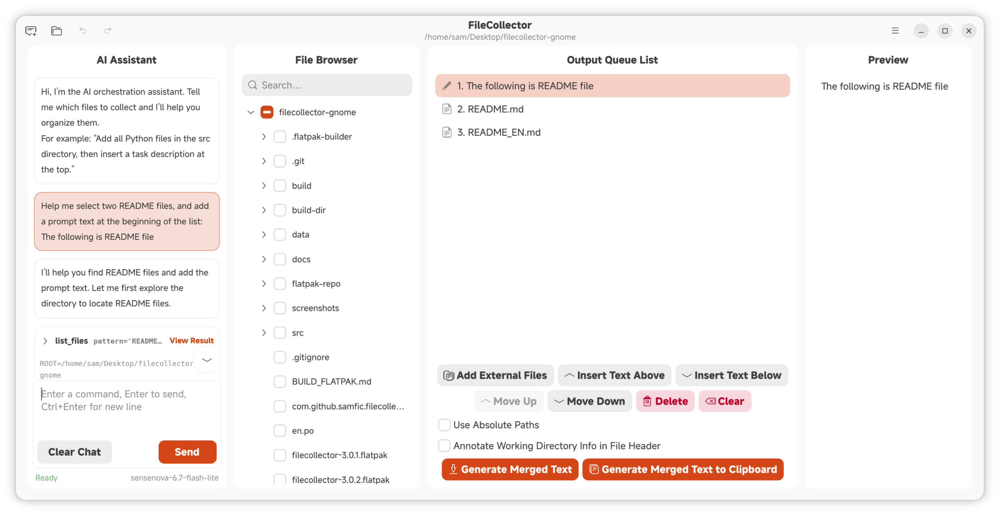

# FileCollector

<div align="center">
  
</div>

[简体中文](README.md)

---

FileCollector is a cross-platform desktop tool for efficiently collecting, organizing files from your working directory, and generating merged text.  
It provides a checkable directory tree, flexible organization list, text insertion and automatic encoding detection, making it ideal for quickly consolidating key code or documents from a project into a single TXT file for further analysis or submission to large language models. The built-in AI assistant sidebar supports natural language-driven file exploration, selection, and orchestration.

## UI Preview



## Usage Guide

For the usage process and tips of the graphical interface, please refer to the [Usage Guide](docs/USAGE_EN.md).

## Features

- **CLI Mode**: Complete all core operations via terminal commands, ideal for scripting and automation
- **MCP Service**: Wrapped as an MCP (Model Context Protocol) service, callable directly by programming tools such as Cursor, VS Code + Copilot
- **Binary File Pre-conversion**: Automatically converts images, PDFs, Office documents, and other binary files into Markdown format, with caching and configurable extensions
- **AI Assistant Panel**: Built-in sidebar chat interface that lets AI directly drive file tree exploration, file selection, orchestration, and merged text generation
- **Progressive Experience**: Seamless handoff between CLI processing and GUI fine-tuning — AI can explore and organize files, then users can take over with the graphical interface at any time
- **Project Management**: Open and save projects
- **Phrase Management**: Manage and organize common phrases
- **Internationalization**: Supports Chinese and English UI, automatically follows system language
- **Modern UI**: Designed following GNOME Human Interface Guidelines (based on libadwaita, also runs on Windows / macOS)
- **Git History Integration**: One-click collection of changed files, export Diff code blocks, quickly build Git context for AI
- **Global Content Search**: `Ctrl+Shift+F` opens a search dialog with async background scanning, encoding auto-detection, result highlighting, and one-click addition of matched files to the orchestration list
- **Scene-based Prompt Templates**: Built-in templates for Bug analysis, API documentation, and code refactoring. Use `/t <id>` slash commands to insert structured placeholders and drive AI execution in one step
- **AI Reading Guide Generation**: One-click AI analysis of the orchestration list to generate a structured table of contents and reading guide
- **Drag-to-reorder**: Each row in the orchestration list has a drag handle on the right; press and hold to reorder

> **Tip**: This repository now supports Windows and macOS (Apple Silicon), but there may be compatibility issues. For an alternative Flet-based cross-platform implementation, see the [Flet version repository](https://github.com/Sam-Fic/filecollector-flet).

## Why Use This Tool?

1. **Solve the Context Dilemma in Programming Tools**: In programming tools, models need to make many tool calls to explore the workspace, which can easily be distracted by irrelevant files and deviate from the topic. Large projects can also trigger context compression. Additionally, large amounts of system prompts in programming tools consume a lot of tokens. This tool allows manual or MCP-assisted selection of important files, consolidating the context into a single file and handing it over to a web-based model (with relatively fewer system prompts) for deep reasoning such as bug analysis, maximizing model inference performance.

2. **Cost Control**: Most web-based models are free (or have free quotas), right?

## Pre-built Flatpak (Recommended)

Pre-built Flatpak packages are available in the [Releases](https://github.com/Sam-Fic/filecollector/releases) section. If you prefer not to build from source, you can directly download and install the `.flatpak` files.

```bash
flatpak install --user <the-downloaded.flatpak-file>
```

Then run:

```bash
flatpak run io.github.sam_fic.filecollector
```

## Pre-built Windows Portable Package

Pre-built Windows portable packages are also available in the [Releases](https://github.com/Sam-Fic/filecollector/releases) section, named like `filecollector-windows-X.Y.Z-x64.zip`. After downloading, **just extract and run — no need to install MSYS2, GTK, or the Visual C++ runtime**: all runtime DLLs are bundled, and MinGW links against the universal C runtime (ucrtbase, etc.) built into Windows 10/11.

> **How to launch: double-click `bin/filecollector-launch.bat`, not `filecollector.exe` directly.**
>
> The package bundles GTK's image loaders (PNG/JPEG, etc.), but the loader cache (`loaders.cache`) records the **build machine's absolute paths**, which are invalid on other computers. The `filecollector-launch.bat` launcher sets the `GDK_PIXBUF_MODULEDIR` environment variable to point at the bundled loaders directory, ensuring image formats render correctly.
> Double-clicking `filecollector.exe` directly will still open the window, but PNG/JPEG and other images may fail to render.

```text
filecollector-windows-X.Y.Z-x64.zip
├── bin/
│   ├── filecollector.exe
│   ├── filecollector-launch.bat   ← double-click this to launch
│   └── *.dll                       (GTK / Adwaita / cmark-gfm runtimes, bundled)
├── lib/gdk-pixbuf-2.0/.../loaders/ (image format loaders)
├── share/glib-2.0/schemas/         (GSettings schemas)
├── share/data/
└── locale/
```

For the detailed build & packaging workflow, see [BUILD_WINDOWS.md](BUILD_WINDOWS.md).

## Build from Source

### Linux

#### Install Dependencies

**Debian / Ubuntu**

```bash
sudo apt install meson valac libgtk-4-dev libadwaita-1-dev libjson-glib-dev libsoup-3.0-dev libgee-0.8-dev libsecret-1-dev libcmark-gfm-dev libgtksourceview-5-dev blueprint-compiler gettext
```

**Fedora**

```bash
sudo dnf install meson vala gtk4-devel libadwaita-devel json-glib-devel libsoup3-devel libgee-devel libsecret-devel cmark-gfm-devel gtksourceview5-devel blueprint-compiler gettext
```

#### Build & Install

```bash
mkdir -p build && cd build
meson setup ..
meson compile
sudo meson install
```

> **Tip**: If you have built before, re-run `meson compile` inside the `build/` directory for incremental compilation of the binary. If you modified translation files under `po/` or `_()` strings in UI, also re-run `sudo meson install` to deploy the updated `.mo` file to the system path.

#### Run

```bash
filecollector          # Launch GUI
filecollector --help   # Show CLI help
filecollector --gui    # Force GUI mode (same as the first command when no other CLI args)
```

> **Tip**:
>
> - The application automatically uses Chinese or English UI based on your system language. To temporarily switch languages, use the `LANGUAGE` environment variable, e.g. `LANGUAGE=en filecollector` to force English display. This works for both GUI and CLI modes.
> - For CLI mode usage, see the [CLI Mode](#cli-mode) section below.
> - **GUI vs CLI behavior**: When any CLI arguments (`--work-dir`, `--select-file`, `--load`, etc.) are detected, the app runs in CLI mode without opening the GUI. **Exception**: Adding `--gui` forces GUI mode — CLI arguments are used only to initialize the interface state, then you can use the GUI for manual adjustments, if the GUI is running, CLI operations will be reflected in the GUI. This is useful when switching from MCP automation to human review.

#### Flatpak Build

```bash
flatpak-builder build-dir io.github.sam_fic.filecollector.json --user --install --force-clean
flatpak run io.github.sam_fic.filecollector
```

You can also hand [BUILD_FLATPAK.md](BUILD_FLATPAK.md) directly to programming tools or AI Agents to leverage the existing mature workflow for standardized packaging.

### Windows

#### Install Dependencies (MSYS2 / mingw64)

Install the toolchain and the full GTK4 stack via the MSYS2 mingw64 terminal (**must** run inside the `mingw64` shell, not the default `MSYS` shell):

```bash
pacman -S --needed mingw-w64-x86_64-meson mingw-w64-x86_64-ninja mingw-w64-x86_64-gcc \
  mingw-w64-x86_64-pkgconf mingw-w64-x86_64-vala mingw-w64-x86_64-cmake \
  mingw-w64-x86_64-gtk4 mingw-w64-x86_64-libadwaita \
  mingw-w64-x86_64-json-glib mingw-w64-x86_64-libsoup3 mingw-w64-x86_64-libgee \
  mingw-w64-x86_64-gtksourceview5 \
  mingw-w64-x86_64-blueprint-compiler mingw-w64-x86_64-gettext mingw-w64-x86_64-libsecret
```

> Note: `cmark-gfm` (GitHub Flavored Markdown rendering, used by the AI chat bubbles) has **no prebuilt MSYS2 package** and must be built from source — see "Build cmark-gfm from source" below.

**Build cmark-gfm from source**

```bash
git clone --depth 1 --branch 0.29.0.gfm.13 https://github.com/github/cmark-gfm.git
cd cmark-gfm
cmake -G Ninja -B build -S . \
  -DCMAKE_INSTALL_PREFIX=$MINGW_PREFIX \
  -DCMARK_SHARED=ON -DCMARK_STATIC=OFF -DCMARK_TESTS=OFF \
  -DCMAKE_POLICY_VERSION_MINIMUM=3.5
cmake --build build
cmake --install build
```

> `$MINGW_PREFIX` is typically `C:/msys64/mingw64` inside the mingw64 shell. After installing, `pkg-config --exists cmark-gfm` should return exit code 0.

> Run `meson` and `ninja` inside the **mingw64** environment, otherwise GTK4 and friends won't be found.

> If `blueprint-compiler` fails on `.blp` with `UnicodeDecodeError: 'gbk' codec can't decode`, Python is reading files with the system GBK encoding. Run `export PYTHONUTF8=1` in the mingw64 shell before `meson compile`.

#### Build & Install

```bash
meson setup build
meson compile
```

> No `meson install` needed: the binary is at `build/filecollector.exe` and can be run directly.

#### Run

```bash
export PYTHONUTF8=1
./build/filecollector.exe          # Launch GUI
./build/filecollector.exe --help   # Show CLI help
```

> At runtime the GTK / cmark-gfm DLLs must be findable — make sure mingw64's `bin` directory is on `PATH` (the mingw64 shell adds it automatically). If double-clicking `filecollector.exe` reports a missing DLL, launch it from the mingw64 shell, or add `C:/msys64/mingw64/bin` to the system `PATH`.

#### Package as Portable Zip

To package a portable zip like the "Pre-built Windows Portable Package" above from source, follow [BUILD_WINDOWS.md](BUILD_WINDOWS.md): it collects the DLLs, bundles the image loaders and GSettings schemas, and generates the `filecollector-launch.bat` launcher. Note that the `GDK_PIXBUF_MODULEDIR` set by the launcher is what makes image rendering work correctly.

### macOS (Unverified)

> The from-source build flow for this platform is **not yet verified**; content to be added.

## Project Structure

```
.
├── data/                                  # Application data files
│   ├── io.github.sam_fic.filecollector.desktop
│   ├── io.github.sam_fic.filecollector.metainfo.xml
│   ├── io.github.sam_fic.filecollector.svg
│   ├── filecollector.gresource.xml
│   └── style.css
├── screenshots/                           # Screenshots
├── src/                                   # Source code
│   ├── main.vala                          # Application entry point (auto-detects CLI or GUI)
│   ├── cli.vala                           # CLI controller
│   ├── window.vala                        # Main window logic
│   ├── window.blp                         # Blueprint UI description
│   ├── config.vala.in                     # Config template (version, etc.)
│   ├── controllers/
│   │   ├── ai_controller.vala             # AI assistant controller
│   │   └── project_controller.vala        # Project controller
│   ├── models/
│   │   ├── app_state.vala                 # Application state model
│   │   ├── item_data.vala                 # Queue item data model
│   │   ├── git_commit.vala                # Git commit data model
│   │   ├── prompt_template.vala           # Scene prompt template model
│   │   └── search_result.vala             # Global search result model
│   ├── services/
│   │   ├── ai_client.vala                 # AI assistant backend (OpenAI-compatible API + Function Calling)
│   │   ├── ai_types.vala                  # AI shared type definitions
│   │   ├── binary_converter.vala          # Binary file to Base64 conversion (image scaling + document-to-PDF rendering)
│   │   ├── binary_preprocessor.vala       # Binary file preprocessing scheduler (VLM invocation and cache management)
│   │   ├── config_manager.vala            # Config/settings/phrases/templates persistence
│   │   ├── file_generator.vala            # File merging and clipboard copy
│   │   ├── git_service.vala               # Git read-only operations (status/diff/log/show)
│   │   ├── multimodal_ai_client.vala      # VLM client (sends Base64 images to vision models)
│   │   ├── preprocess_cache.vala          # Preprocessing cache (SHA256 hash + manifest management)
│   │   ├── project_manager.vala           # Project save and load
│   │   ├── search_service.vala            # Global content search engine (async, binary skip, encoding detection)
│   │   ├── undo_manager.vala              # Undo/redo management
│   │   └── vlm_queue.vala                 # VLM preprocessing queue manager (concurrency control, pause/cancel)
│   ├── utils/
│   │   ├── encoding_helper.vala           # Encoding auto-detection and conversion
│   │   └── glob_helper.vala               # Glob pattern matching utilities
│   ├── vapi/
│   │   └── cmark.vapi                     # cmark (Markdown) Vala bindings
│   └── widgets/
│       ├── ai_panel.vala                  # AI assistant chat panel (bubbles + tool call cards + slash command autocomplete)
│       ├── ai_settings_dialog.vala        # AI assistant settings dialog
│       ├── global_search_dialog.vala      # Global content search dialog
│       ├── markdown_view.vala             # Markdown rendering view
│       ├── phrases_picker.vala            # Common phrases picker and management
│       ├── settings_dialog.vala           # Settings dialog
│       └── templates_manager.vala         # Scene prompt template management dialog
├── docs/                                  # Usage documentation
│   ├── images/                            # Documentation images
│   ├── USAGE.md                           # Chinese usage guide
│   └── USAGE_EN.md                        # English usage guide
├── po/                                     # gettext translation directory
│   ├── filecollector.pot                   # template (generated by xgettext, not tracked)
│   ├── zh_CN.po                            # Simplified Chinese translation
│   ├── POTFILES                            # List of translatable source files (for gettext)
│   ├── LINGUAS                             # List of supported languages
│   └── meson.build                         # i18n build configuration
├── BUILD_FLATPAK.md                       # Flatpak build guide (for AI assistants)
├── BUILD_WINDOWS.md                       # Windows portable package build guide (for AI assistants)
├── meson.build                            # Meson build configuration
└── io.github.sam_fic.filecollector.json   # Flatpak build manifest
```

### Keyboard Shortcuts

| Shortcut       | Action                  |
| -------------- | ----------------------- |
| `Ctrl+O`       | Open project            |
| `Ctrl+S`       | Save project            |
| `Ctrl+N`       | Clear all items         |
| `Ctrl+E`       | Add external files      |
| `Ctrl+I`       | Insert text above       |
| `Ctrl+Shift+I` | Insert text below       |
| `Ctrl+↑`       | Move item up            |
| `Ctrl+↓`       | Move item down          |
| `Delete`       | Delete selected item    |
| `Ctrl+G`       | Generate merged text    |
| `Ctrl+Shift+C` | Generate to clipboard   |
| `Ctrl+J`       | Toggle AI assistant     |
| `Ctrl+Shift+F` | Global content search   |
| `Ctrl+,`       | Language settings       |
| `Ctrl+/`       | Show keyboard shortcuts |
| `F1`           | About                   |
| `Ctrl+Q`       | Quit                    |

All shortcuts are also viewable via the **Keyboard Shortcuts** menu item.

## CLI Mode

FileCollector features a built-in CLI mode that allows you to perform all core operations through the terminal without launching the GUI, making it ideal for scripting and automation. Meanwhile, when the GUI is active, CLI mode can seamlessly integrate with the GUI to reflect its progress and status.

### Usage

Simply run `filecollector` with CLI arguments to enter command-line mode. If no CLI arguments are detected, the GUI starts normally.

```bash
filecollector [options...]
```

### Command Reference

| Option               | Description                                          |
| -------------------- | ---------------------------------------------------- |
| `--work-dir DIR`     | Set the working directory                            |
| `--select-file PATH` | Add a file to the queue (can be used multiple times) |
| `--add-text "TEXT"`  | Add custom text (can be used multiple times)         |
| `--move FROM TO`     | Move item at index FROM to index TO                  |
| `--remove INDEX`     | Remove item at INDEX                                 |
| `--clear`            | Clear all items from the queue                       |
| `--list-items`       | List all items in the current queue                  |
| `--export PATH`      | Export merged text to file                           |
| `--absolute`         | Use absolute paths                                   |
| `--header`           | Add header with working directory info               |
| `--load FILE`        | Load state from a project file                       |
| `--save FILE`        | Save current state to a project file                 |
| `--gui`              | Initialize state with CLI args then open the GUI     |
| `--help`, `-h`       | Show this help message                               |

### Workflow Examples

**Build and export:**

```bash
filecollector --work-dir ./project \
    --select-file src/main.vala \
    --select-file src/utils/helper.vala \
    --add-text "=== Configuration Files ===" \
    --select-file config.ini \
    --move 3 2 \
    --header \
    --export output.txt
```

**Export from a project file:**

```bash
filecollector --load my.project.fcol --export output.txt
```

**Build and save a project (for use in GUI):**

```bash
filecollector --work-dir ./project \
    --select-file file1.txt --select-file file2.txt \
    --save my.project.fcol
```

**List the current queue:**

```bash
filecollector --load my.project.fcol --list-items
```

**Load a project and open GUI for manual adjustment:**

```bash
filecollector --load my.project.fcol --gui
```

### Design Notes

CLI mode shares the same data model and business services (`ItemData`, `FileGenerator`, `ProjectManager`) with GUI mode, but does not depend on the GTK/Adw graphics libraries, making startup faster. The core CLI code resides in the standalone [cli.vala](src/cli.vala) file.

## MCP (Model Context Protocol) Service

FileCollector has been wrapped as an MCP service, allowing LLMs in programming tools (such as Cursor, VS Code + Copilot) to directly call it to complete the following workflow:

1. The user gives the model in the programming tool a question or task (e.g., "This project has xx issues, please find the related files and export a single TXT file").
2. The model performs file exploration and uses this tool to select key files related to the issue.
3. The model inserts instructions (the problem to solve) at appropriate positions.
4. Call the tool to generate a structured TXT file.
5. The user uploads this TXT file to a web-based LLM (such as Claude, ChatGPT, etc.) for deep reasoning and problem-solving planning.
6. Based on the plan returned by the model, the user can use low-cost models in the programming tool to execute actual problem-solving operations.

This design separates **file exploration and code selection** (done by the model inside the programming tool) from **complex reasoning** (done by the web-based model), fully leveraging the strengths of different models while keeping costs controllable.

**Visit [filecollector-mcp-server](https://github.com/Sam-Fic/filecollector-mcp-server) for more details and installation instructions**

## AI Assistant Panel

FileCollector includes a built-in **sidebar AI assistant** that lets you drive the entire workflow using natural language directly in the GUI, without needing programming tools or MCP services. Click the **AI** button in the top-left corner of the toolbar to expand/collapse the sidebar.

### Key Capabilities

- **Natural Language Orchestration**: Tell the AI "add all Python files in the `src` directory, then insert a task description at the top" — the AI will automatically call tools to handle file selection, text insertion, reordering, and all other steps.
- **File Exploration & Reading**: The AI can browse the working directory's file tree and read file contents on demand to aid decision-making.
- **Real-time Feedback**: Every tool call (set working directory, add files, read files, reorder items, etc.) is displayed as an expandable tool card in real time, making results immediately clear.
- **Live GUI Sync**: When the AI modifies the orchestration list, the center panel updates the preview immediately, and you can take over to fine-tune at any time.
- **Slash Command Autocomplete**: Type `/t` or `/template` in the AI input to get an auto-complete template list with keyboard ↑↓ navigation, Enter to confirm, Esc to dismiss, or mouse click to apply.
- **AI Local Bypass Injection**: `add_git_diff` and `add_git_commit_diff` tools execute Git commands locally and inject diffs directly into the list, completely bypassing the LLM context.

### Supported Tools (Function Calling)

The AI interacts with the GUI engine through the following tools (sharing the same semantics as CLI / MCP):

| Tool               | Purpose                                               |
| ------------------ | ----------------------------------------------------- |
| `set_work_dir`     | Switch the working directory                          |
| `add_files`        | Batch-add files to the orchestration list             |
| `add_text`         | Insert custom text into the list                      |
| `remove_item`      | Remove a list item by id                              |
| `move_item`        | Reorder items                                         |
| `clear_items`      | Clear the orchestration list                          |
| `set_use_absolute` | Toggle absolute/relative path mode                    |
| `set_show_header`  | Toggle whether to annotate the working directory      |
| `list_files`       | Browse the working directory (recursive file listing) |
| `read_file`        | Read file contents (with line numbers)                |
| `get_git_status`   | Get Git working tree status (modified/added files)   |
| `get_git_diff`     | Get Git diff (working tree or staged area)           |
| `get_git_log`      | List recent Git commits                              |
| `get_git_commit_diff` | Get the code diff of a specific commit            |
| `add_git_diff`     | Inject working tree/staged diff directly into list (bypasses LLM, saves tokens) |
| `add_git_commit_diff` | Inject a specific commit's diff directly into list (bypasses LLM) |

### Binary File Pre-conversion (VLM)

FileCollector can automatically convert binary files into Markdown format, eliminating manual preprocessing.

- **Image files** (PNG, JPEG, WebP, BMP, TIFF, etc.): Automatically scaled to a maximum of 2048px and encoded as Base64, then sent directly to VLM for text extraction or content understanding.
- **Document files** (PDF, DOCX, PPTX, XLSX, ODT, ODP, ODS, RTF, etc.): First converted to PDF via LibreOffice, then rendered as image sequences via `pdftoppm`, and sent page-by-page to VLM.
- **Conversion cache**: Converted results are cached in the `.filecollector_cache/` directory under the working directory. The system uses SHA256 file hashes to determine whether re-conversion is needed, avoiding redundant processing.
- **Configurable extensions**: In the AI Settings dialog, you can customize the list of binary file extensions allowed for VLM processing. Changes automatically trigger re-evaluation of the preprocessing queue.

### VLM Providers

VLM pre-conversion supports two providers, switchable via the **Provider** dropdown in the **AI Settings → VLM** tab. Both configurations are saved independently:

- **OpenAI Compatible** (default): Sends image sequences via the OpenAI Chat Completions protocol. Requires API Base URL, Key, and Model Name (see below). Works with GPT-4o, Claude, Ollama, etc.
- **PaddleOCR Cloud**: Baidu AI Studio's document OCR/parsing service. Only requires an **Access Token**; the endpoint `https://paddleocr.aistudio-app.com/api/v2/ocr/jobs` and model `PaddleOCR-VL-1.6` are hardcoded.
  - **Getting a Token**: Go to <https://aistudio.baidu.com/account/accessToken>, sign in, copy your personal Access Token, and paste it into the setting.
  - **File handling**: Images and PDFs are uploaded as-is (original fidelity, no local scaling or page rendering). Office documents (DOCX/PPTX/XLSX/ODT etc.) are still converted to PDF via LibreOffice first, then uploaded. After submission the job is polled automatically; multi-page results are concatenated in page order into the final Markdown (embedded images in results are ignored by default).

### VLM Configuration

Open **AI Settings** (Menu → AI Settings) and switch to the **VLM** tab:

1. Check **Enable VLM**.
2. In the **Provider** dropdown, select **OpenAI Compatible** or **PaddleOCR Cloud**.
   - **OpenAI Compatible**: Enter the **API Base URL** (OpenAI Chat Completions protocol, e.g., `https://api.openai.com/v1`), **API Key**, and **Model Name** (e.g., `gpt-4o`, `claude-3-opus`, or other vision-capable models). (Optional) Customize the **Preprocessing Prompt** — leave empty to use the built-in prompt.
   - **PaddleOCR Cloud**: Only the **Access Token** is required (see above). All other parameters (endpoint, model) are built-in.
3. Click **Test Connection** to verify the configuration, then save.

### Configuration

Open **AI Settings** (Menu → AI Settings):

1. Check **Enable AI Assistant**.
2. Enter the **API Base URL** (compatible with OpenAI Chat Completions protocol, e.g., `https://api.openai.com/v1`; also works with Azure OpenAI, self-hosted gateways, local models like Ollama, etc.).
3. Enter the **API Key** and **Model Name** (e.g., `gpt-4o-mini`, `deepseek-chat`, etc.).
4. (Optional) Customize the **System Prompt** — leave empty to use the built-in orchestration prompt.
5. Click **Test Connection** to verify the configuration, then save.

All settings are stored in the `ai` field of `settings.json`. **API keys are stored locally only** and are never uploaded to any remote service.

### Usage Examples

> Please add all AI sidebar-related files in this project to the orchestration, then insert a description text at the beginning.

AI's processing flow: calls `list_files` to locate AI sidebar-related files (`ai_panel.vala`, `ai_client.vala`, `ai_settings_dialog.vala`) → `add_files` to batch-add them to the orchestration list → `add_text` to insert explanatory text at the beginning.

> Export to `output.txt` using relative paths, and include a working directory header.

AI's processing flow: calls `set_use_absolute(False)` and `set_show_header(True)`, then triggers the GUI export process.

### Progressive Experience

GUI and CLI are combined to enable seamless human-AI collaboration:

1. Use MCP service in Cursor for the LLM to automatically explore and organize project files.
2. When the generated file list requires manual adjustment, run `filecollector --load ~/.config/filecollector/mcp_state.fcol --gui` in the terminal. The `--gui` flag ensures the GUI opens (without it, the command runs in CLI mode only).
3. The GUI opens, displaying the model's selected file list. You can check, reorder, and save.
4. Return to Cursor for the LLM to continue subsequent work.

## Git History Integration

FileCollector includes built-in Git read-only inspection capabilities, making it easy for developers to quickly collect files and Diff context related to their current changes. Click the **Git icon** in the top toolbar to switch from file tree mode to Git commit history mode.

### Action Buttons

After switching to Git mode, the action buttons below the center orchestration list will switch to the following three Git-specific functions:

| Button | Purpose |
| --- | --- |
| **Add All Changed Files** | Runs `git status` to retrieve all modified and newly added files in the working directory, then batch-adds them to the orchestration list. Useful for the scenario: "I want to collect all files involved in my current changes." |
| **Export Working Tree Diff** | Runs `git diff` to get all unstaged code changes in the working directory, then inserts them as a `diff` code block into the orchestration list. Useful for the scenario: "Let AI analyze my current code changes." |
| **Export Selected Commit Diff** | After selecting a commit from the left Git commit list, runs `git show` to get the full diff of that commit, then inserts it as a `diff` code block into the orchestration list. Useful for the scenario: "Let AI analyze the code changes in a specific historical commit." When a commit is selected, the right preview panel renders a real-time red/green highlighted diff view. |

### Typical Workflow

1. Click the Git icon in the top toolbar to switch to Git commit history mode.
2. The left panel automatically loads the most recent 100 commits, with search support by commit message or hash.
3. Click a commit to instantly preview its code diff with red/green highlighting in the right panel.
4. Right-click a commit to copy its full hash to the clipboard.
5. Click **Export Selected Commit Diff** to insert the diff code block into the orchestration list.
5. Click **Add All Changed Files** to add all currently changed files to the orchestration list.
6. Switch back to file tree mode to supplement with other related files via checkboxes.
7. Generate the merged text and hand it to AI for in-depth analysis.

> **Tip**: All Git operations are **read-only inspections** (`git status`, `git diff`, `git log`, `git show`). They will never execute write operations like `commit` or `push`, ensuring your Git workflow remains unaffected.

## License

This project is licensed under the MIT License.

## Acknowledgements

Special thanks to [Decembered](https://github.com/Decembered) for contributions and support.

The token estimation feature is inspired by the open-source project [tokenx](https://github.com/johannschopplich/tokenx).

This project uses [cmark-gfm](https://github.com/github/cmark-gfm) (GitHub Flavored Markdown parser) to render Markdown in the AI chat bubbles and the reading guide.

The syntax highlighting colors in the code preview are taken from the [Catppuccin](https://github.com/catppuccin/catppuccin) palette (Latte for light / Mocha for dark).

> Contributions and ideas are welcome!
